# AISCN'26 Minor Project 2
## Cyber Security Internship Report

**Name:** Anand Chahar  
**Roll No.:** 202501100400050  
**College:** KIET Group of Institutions

---

# Objective

This report documents practical learning in web application reconnaissance, HTTP traffic analysis using Burp Suite, cryptographic hashing, security laboratory exercises, and responsible vulnerability disclosure.

The activities were carried out ethically on training platforms to understand how web applications communicate, how security analysts inspect requests and responses, and how common vulnerabilities are identified.

---

# Task 1 – Web Application Reconnaissance

Reconnaissance was performed on the OWASP Juice Shop training application. The application interface, login page, search functionality and product pages were explored to understand publicly accessible components before any testing.

During the exercise, the hosted demo later displayed a **Heroku Professional Error**. The issue was verified on multiple devices, indicating a server-side availability problem rather than a client-side configuration issue.

## Figures

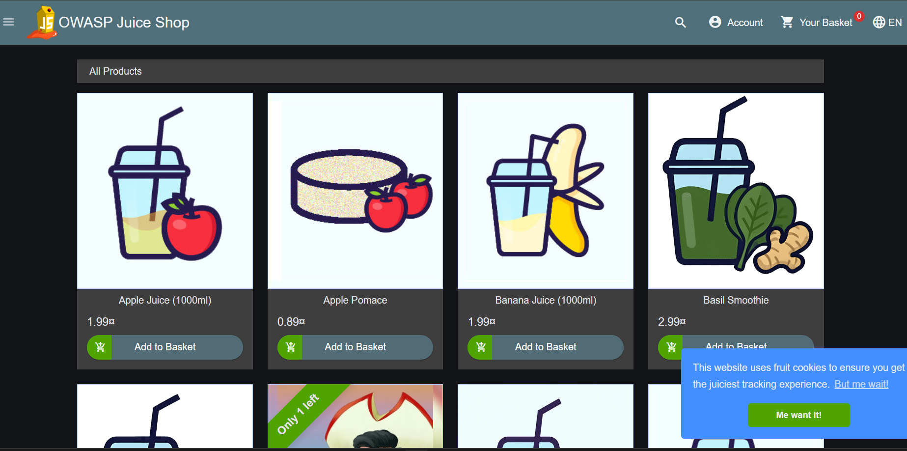

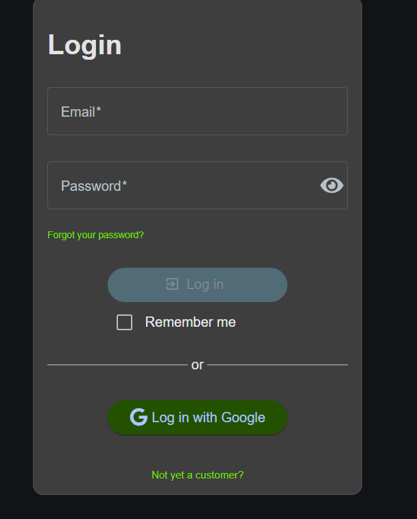

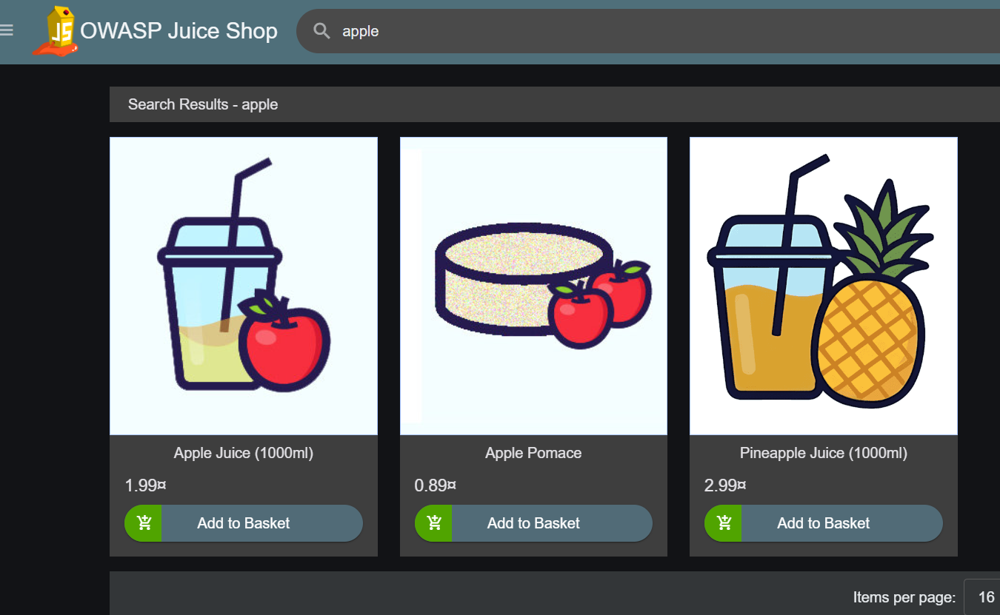

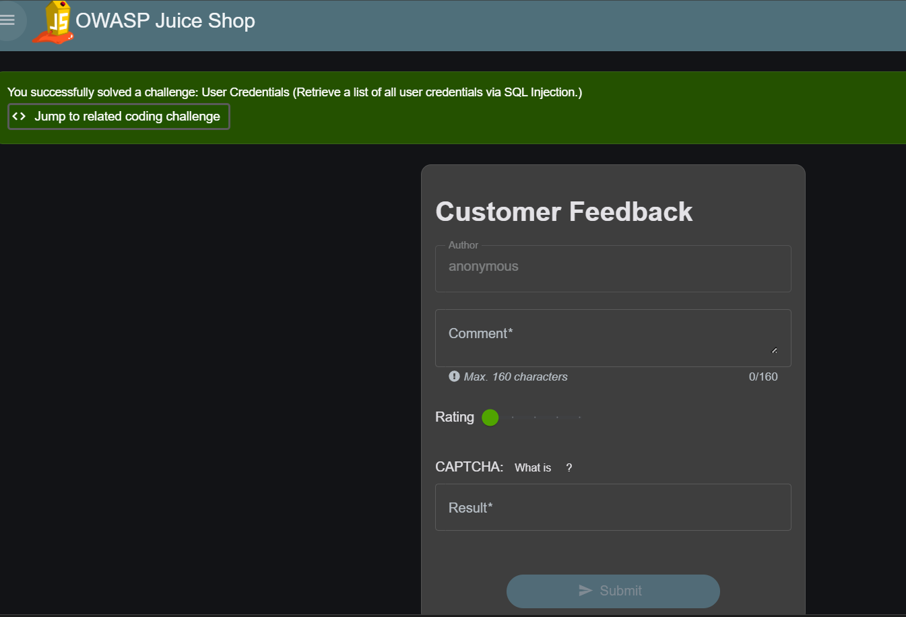

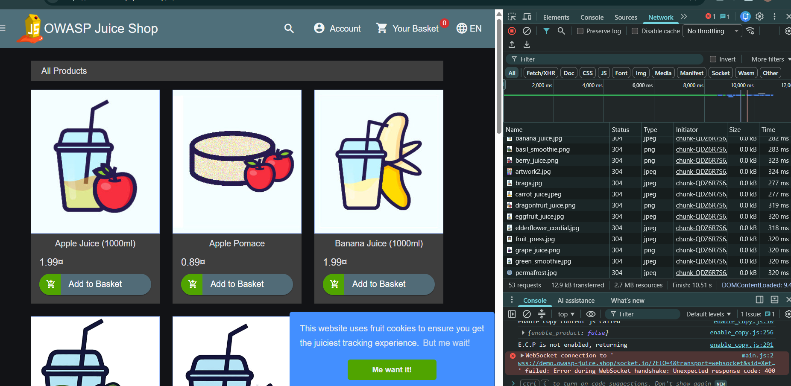

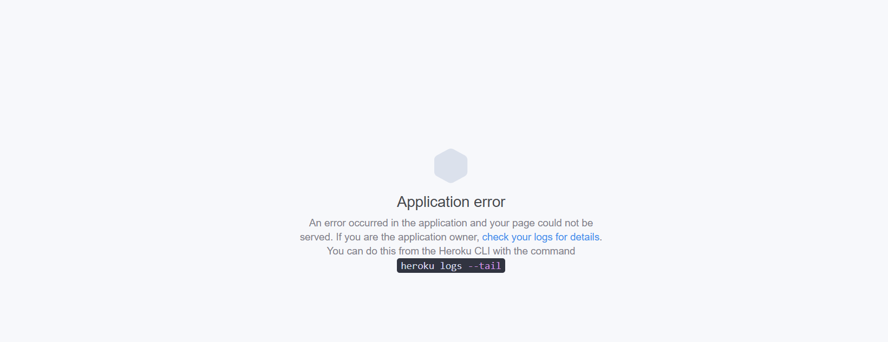

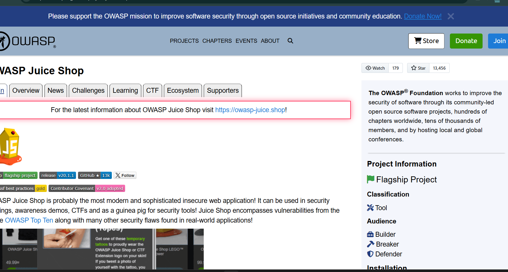

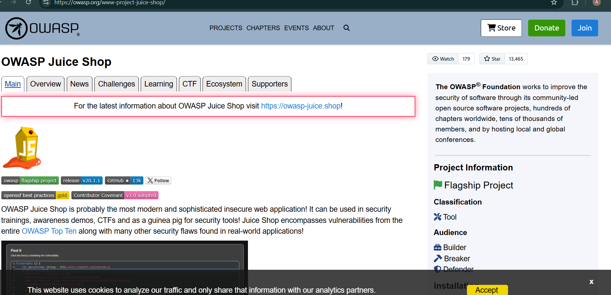

---

# Task 2 – HTTP Request Analysis using Burp Suite

HTTP traffic generated while browsing OWASP Juice Shop was captured using Burp Suite Community Edition.

The captured requests and responses were analysed to understand browser-server communication, HTTP methods, cookies, response headers and status codes.

## Figures

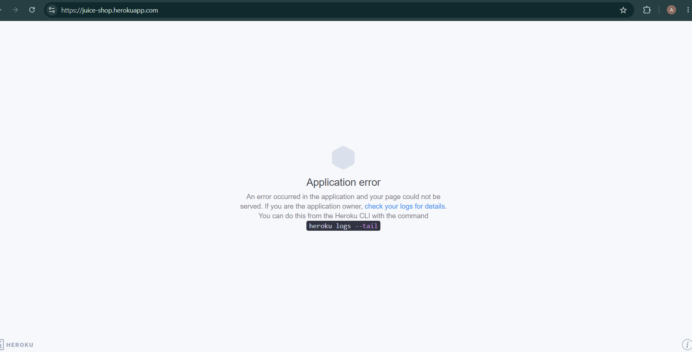

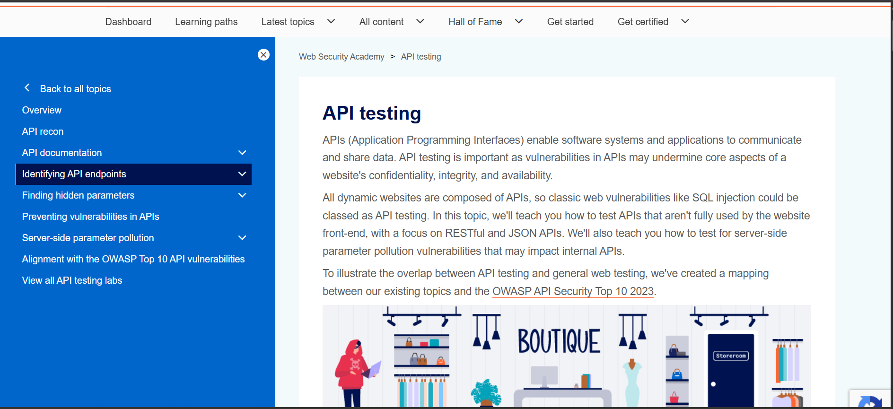

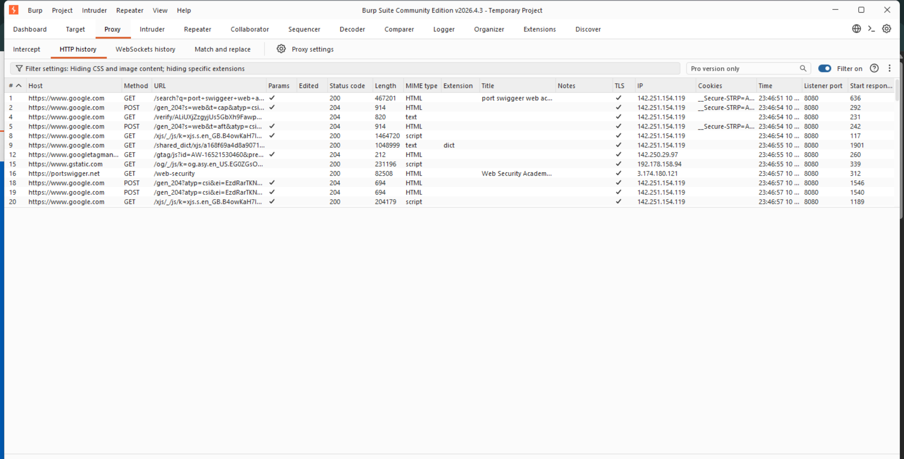

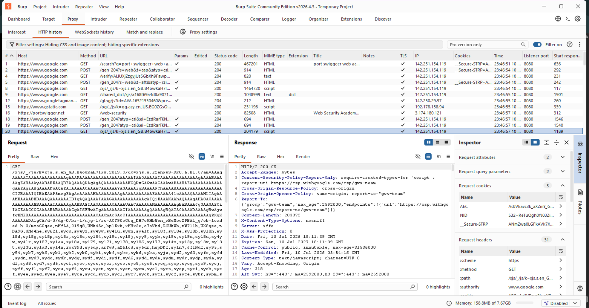

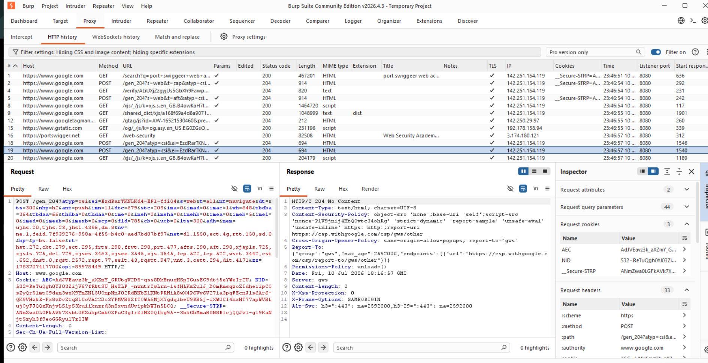

---

# Task 3 – Cryptography & Hashing Basics

SHA-256 and MD5 hashes were generated for the provided text.

The exercise demonstrated the practical differences between modern and legacy hashing algorithms.

### Comparison

| MD5 | SHA-256 |
|------|----------|
| 128-bit Output | 256-bit Output |
| Faster | More Secure |
| Collision Vulnerable | Collision Resistant |
| Not Recommended | Recommended |

## Figures

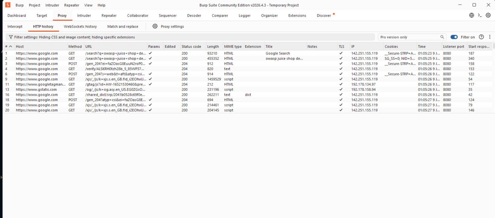

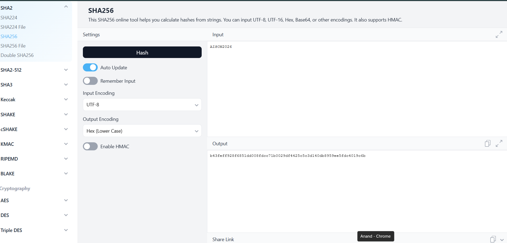

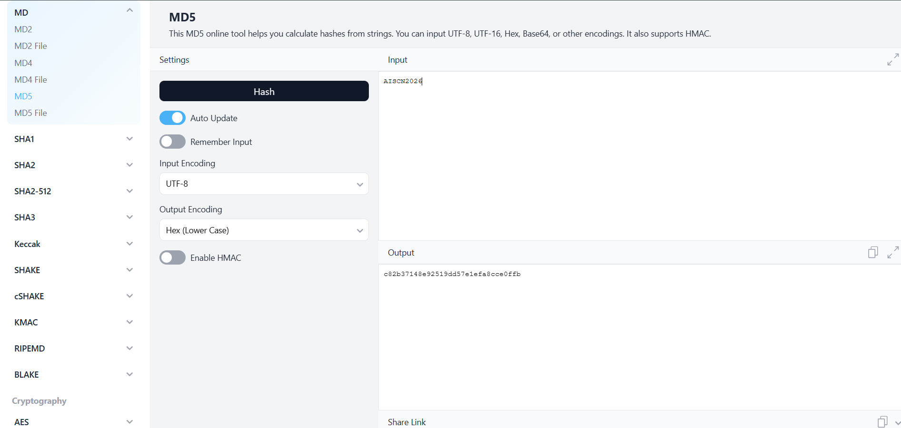

---

# Task 4 – Beginner Web Security Lab

The PortSwigger Web Security Academy beginner labs were explored to understand common web vulnerabilities and secure application behaviour.

The activity demonstrated how security flaws are identified and mitigated through secure coding practices.

## Figures

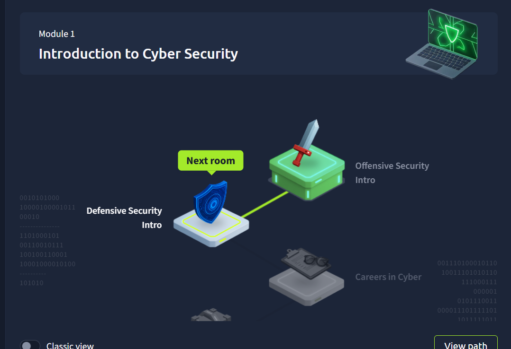

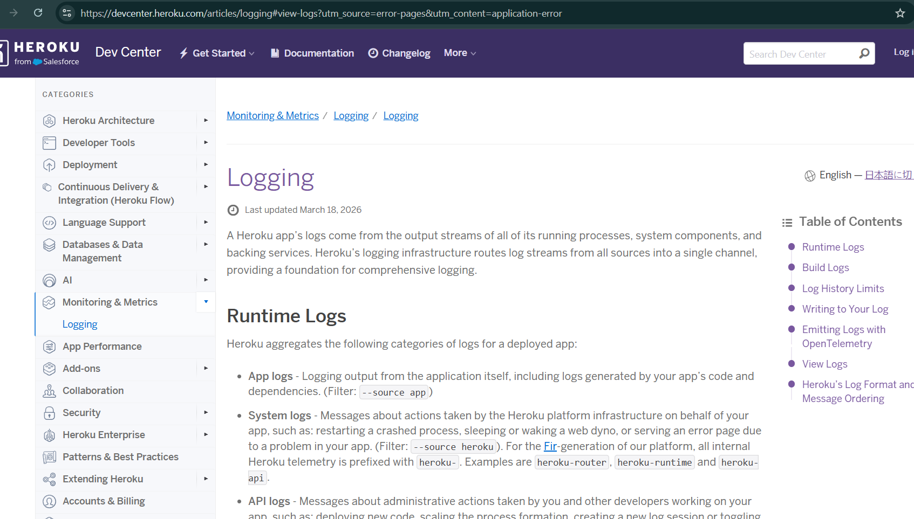

---

# Task 5 – Bug Bounty Case Study

A public bug bounty disclosure was reviewed to understand responsible vulnerability disclosure.

The selected case demonstrated how a researcher responsibly reported a vulnerability, the organisation fixed it, and the disclosure was made public only after remediation.

## Figures

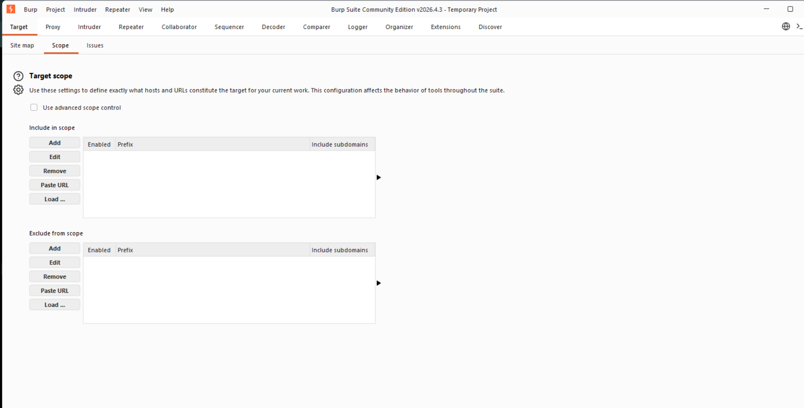

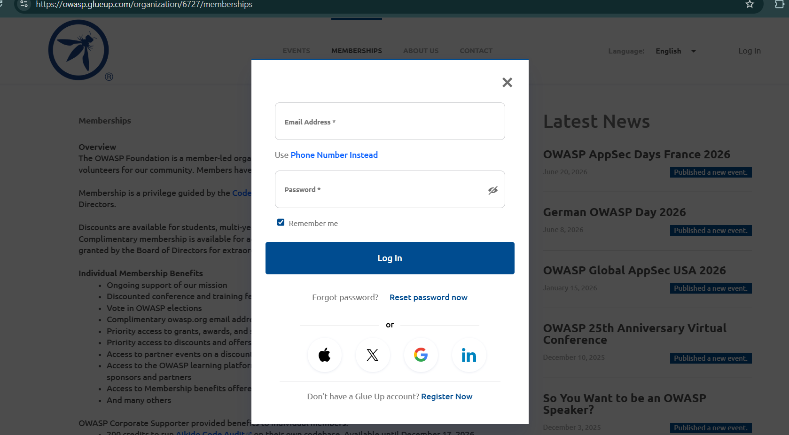

---

# Conclusion

This internship project provided practical exposure to:

- Web Application Reconnaissance
- HTTP Traffic Analysis
- Burp Suite
- Cryptographic Hashing
- Beginner Web Security
- Responsible Bug Bounty Practices

Beyond completing the assigned tasks, the project strengthened both conceptual understanding and practical confidence in cybersecurity fundamentals.

---

# Tools Used

- OWASP Juice Shop
- Burp Suite Community Edition
- PortSwigger Web Security Academy
- MD5 Hash Generator
- SHA-256 Hash Generator

---

# Skills Acquired

- Web Application Reconnaissance
- HTTP Request & Response Analysis
- Burp Suite Traffic Inspection
- Session & Cookie Analysis
- Cryptographic Hashing
- Web Security Fundamentals
- Responsible Vulnerability Disclosure
- Bug Bounty Workflow

---

## Author

**Anand Chahar**

B.Tech CSE (AI & ML)

KIET Group of Institutions
